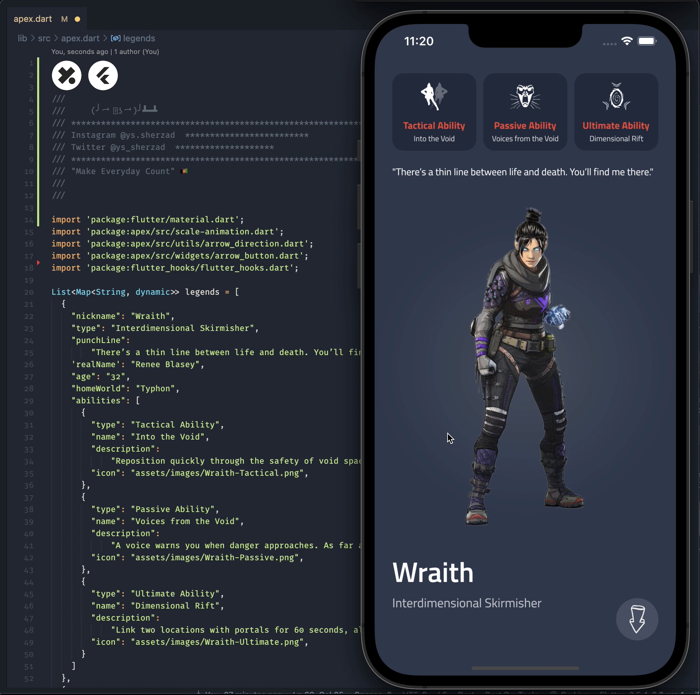

# Apex Legends 👑
A little bit of fun. Built with Flutter




**Installation**

Clone the repo
```
git clone https://github.com/ys-sherzad/ApexLegends.git
```
On you project directory

```
flutter pub get
```

Run the app
```
flutter run
```

---

**Brought to you by:**
[Codeys.io](https://codeys.io) 💎

_Transforming mobile experiences for businesses and developers._
